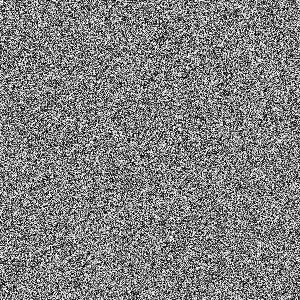

# Prando

[](https://www.npmjs.com/package/prando)
[](https://travis-ci.org/zeh/prando)
[](https://coveralls.io/github/zeh/prando?branch=master)
[](https://david-dm.org/zeh/prando)
[](https://david-dm.org/zeh/prando.js#info=devDependencies)

Prando is a determistic *pseudo-random number generator*. It can be used to create a series of random numbers that can later be re-created given the same seed.

Its goals are:

* Generate a random number sequence
* Reproducibility via a seed
* Fast generation

The counterpoint is that it is not trying to be [cryptographically secure](https://en.wikipedia.org/wiki/Cryptographically_secure_pseudorandom_number_generator).

Prando is created in TypeScript for extra code strength, but can be used both in JavaScript and TypeScript. The advantage of using it in TypeScript projects is that you get the benefit of code completion ("intellisense") by default.

## Motivation

Prando is  better suited for games and user interfaces where randomness need to be taken into account deterministically.

For example, when creating React components for a Web page with random styles, one wouldn't want to use `Math.random()` during the `render()` call, as this would cause the element's style to change on every component update. Instead, by reusing a Prando random number generator, the same sequence of random numbers can be obtained when re-rendering a component.


## Algorithm

Prando current uses a simple xorshift for 32 bits based on [the triplet combination (13, 17, 5) by George Marsaglia](http://www.jstatsoft.org/v08/i14/paper). This combination has a cycle of 2<sup>32</sup>-1, meaning it would take 4,294,967,296 iterations until the sequence repeats itself.

This can be seen in the noise map generated by calculating values in the 0..255 range for colors in a 300x300 image. No obvious patterns are seen:



## Installation

Simply install Prando as a module dependency using NPM:

```shell
npm install prando --save
```

## Usage

Import:

```javascript
// Import (JavaScript ES5)
var Prando = require('prando').default;

// Import (JavaScript ES6 and TypeScript)
import Prando from 'prando';
```

Create an instance:

```javascript
// Pseudo-random (time-based) seed
let rng = new Prando();

// Specific number seed
let rng = new Prando(123);

// Specific string (checksum-based) seed
let rng = new Prando("some-id");
```

Get a number:

```javascript
// Between 0 (inclusive) and 1 (exclusive)
let num = rng.next();

// Between a min (inclusive) and a max (exclusive)
let num = rng.next(2, 10);
```

You can generate as many pseudo-random values as you want.

You can also reset the generator:

```javascript
rng.reset();
```

After being reset, every call to `next()` will generate the same numbers as if the instance had just been created. Example:

```javascript
let rng = new Prando(12345678);
console.log(rng.next()); // 0.6177754114889017
console.log(rng.next()); // 0.5784605181725837

rng.reset();
console.log(rng.next()); // 0.6177754114889017 again
console.log(rng.next()); // 0.5784605181725837 again
```

## License

[MIT](LICENSE.md).